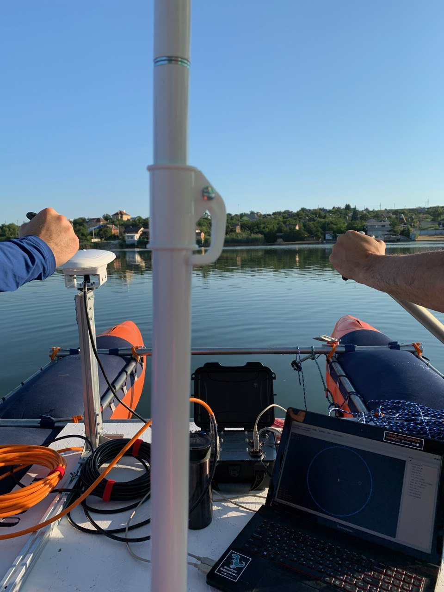
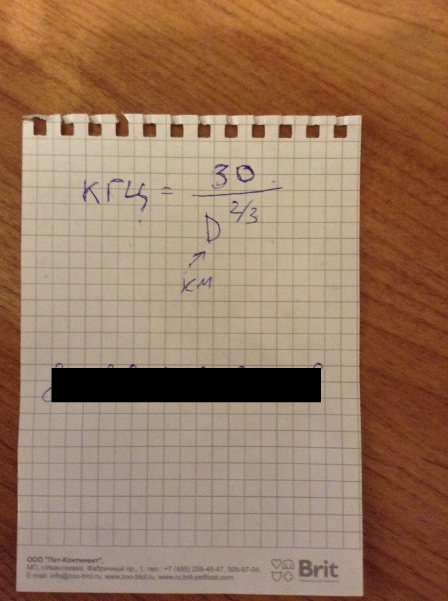
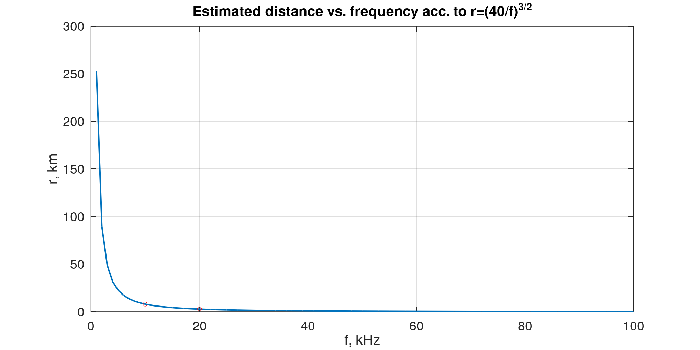
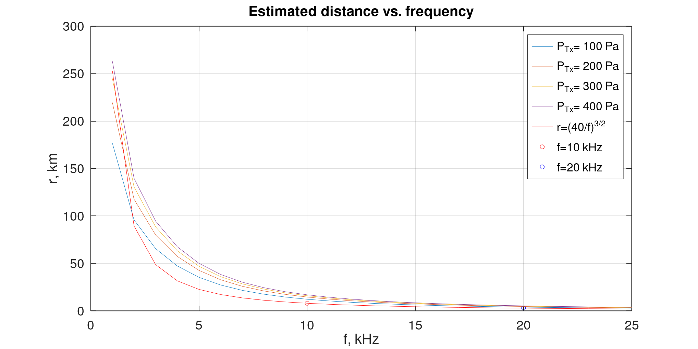

### Приветствую, глубокоуважаемые!

> _"Кто не занимается обследованием и изучением, тот не имеет права высказываться."_ </br> (С) Мао Цзэдун. Период до основания КНР

Вспомнил я тут о сокровенном, и даже сакральном эмпирическом знании. Не считая себя вправе скрывать его от широкой общественности, излагаю.



## Автобиографичная история

Дело было году наверное в 2010-ом, в бытность мою еще научным сотрудником НИИ. В курилке случился у меня диалог с одним из наших учителей - Игорем Владимировичем Бобровским. 
Игорь Владимирович, пожалуй, стал для меня (уверен, и для моих коллег тоже) образцом ученого: за скромностью и простотой речи скрывалось фантастически глубокое советское образование, богатейший опыт и завидная острота мысли. Он никогда не использовал сложных терминов и формулировок, если только без них было совсем не обойтись.

Поясню на контрасте:  
Когда я слышу что-то вроде "Я иду на горизонте", "Дифферентуюсь", "Мы на нцатом шпангоуте" - я делаю вывод, что скорее всего, передо мной человек с фрагментарными знаниями, который спешит пустить пыль в глаза и удивить всех где-то ухвачеными терминами и профжаргоном.  

Когда я впервые услышал "Дифферентуюсь" я начинал вспоминать, что есть такие понятия как "Крен" и "Дифферент". Крен бывает на борт, "Рыскание" - это когда самолет или судно поворачивают нос в горизонтальной плоскости, а "Дифферент" это, стало быть, наклон на нос или корму. Судно-то жесткое, если есть дифферент на нос, то на корму он тоже есть, только с другим знаком. Наверное, подумал я, речь идет о выравнивании судна, возник дифферент и его надо устранить или наоборт - сделать. А как спросить - ведь все же тогда поймут, что я не знаю что такое "Дифферентуюсь"!

Когда я впервые услышал "мы на нцатом шпангоуте" это поистине повергло меня в раздумья: что такое шпангоут, еще примерно понятно, но откуда они начинают отсчитываться? От кормы, носа или от середины? Сколько их вообще бывает? "нцатый" - это где? Ближе к носу или корме? Какое расстояние между шпангоутами? Оно всегда одинаковое или разное? А сколько шпангоутов вообще у судна, о котором идет речь? Кстати, а о каком судне речь?

Так вот, Бобровский никогда так не говорил. Напротив, он всегда изьяснялся так, чтобы всем было понятно.
Когда я в какой-то статье использовал термин "релевантный", он, вычитывая ее, улыбнулся и сказал: "Релевантный. Красивое слово. А мне вот еще нравится слово "Астролябия" - тоже красивое". Умел тонко намекнуть.

Я тогда совсем мало что знал по нашей гидроакустической теме, но то, что дальность гидроакустической связи зависит от частоты я понимал, не понимал только как _именно_. Собственно, и сейчас я не могу сказать, что понимаю это настолько, насколько мне хотелось бы.

На мой вопрос, есть ли какая-то средняя оценка, на какую максимальную дальность связи можно рассчитывать в идеальных условиях, исходя только из несущей частоты сигнала он ответил утвердительно: да мол, есть простая формула. Я постарался запомнить простую формулу и вернувшись в кабинет сразу записал её: там буквально два действия и один параметр - частота. Он еще добавил: "Она простая, можно самому вывести". Я с тех пор иногда думаю об этом, стоит ли упоминать, что сам я ничего так и не вывел? Впрочем, вернемся к формуле чуть позже.

## Копнем чуть _глубже_

### 1. Распад и затухание

> _"То потухнет, то погаснет"_ </br> Фразеологизм

Как прикинуть, на какую максимальную дальность можно рассчитывать?
Абстрагируемся сейчас от других условий распространения сигнала вроде многолучевого распространения, конструкции приемной и передающей антенн и прочего.

Мы знаем, что затухание звуковых колебаний в воде зависит о частоты. Существет ощутимое число работ, посвященных получению эмпирических зависимостей, по которым можно рассчитать коэффициент поглощения, вот несколько из них, по именам авторов:

- Ainslie & McColm, 1998[^1]
- Fisher & Simmons, 1977[^2]
- Francois & Garrison, 1982[^3][^4]

Итак, чтобы звук затухал, у него нужно отбирать энергию. Есть два с половиной механизма, как у звуковой волны в морской воде отбирается энергия. Эти механизмы доступно описаны в работе[^1].

#### 1.1. Поглощение за счет вязкости воды

На частотах выше 100 кГц движение частиц под воздействием звуковых колебаний производит тепло за счет вязкого трения. При прохождении каждого последующего отрезка расстояния потеря энергии растет экспоненциально. Поэтому удобно использовать логарифмическую шкалу.

Как правило, коэффициент поглощения $α$ измеряется в дБ/км. 

Какая часть энергии у волны останется от исходной $E$ при заданном $α$ на расстоянии $r$ от источника? Вот такая:

$$E_r = E·\left( 10^{-\frac{αr}{20}}\right)^2  $$

Например, если **α** = 1 дБ/км, это значит, что на каждом пройденном километре энергия звуковой волны уменьшается на 21%:

Согласно[^1] коэффициент $α$ зависит от частоты звукового колебания $f$, температуры воды $T$ и давления или глубины $z$. Конечно, перевод давления в глубину в некоторой степени зависит от других параметров, но эффект достаточно мал для данной задачи и для рассчета коэффициента используется глубина $z$ в километрах.

Формула для рассчета коэффициента поглощения в пресной воде выглядит следующим образом:

$$α = 0.00049f^2e^{-(T/27+z/17)} $$

Видно, что коэффициент поглощения растет пропорционально квадрату частоты $f$, поэтому на частотах выше 1 МГц в качестве единиц измерения используют уже дБ/м. А на слышимых частотах эффект весьма незначительный. Обращаем внимание, что при увеличении глубины и/или температуры, коэффициент поглощения уменьшается, так как показатель степени отрицательный.

#### 1.2. Поглощение растворенными веществами

В морской воде растворено множество различных веществ, молекулы которых имеют более одного устойчивого состояния. Переход между этими состояниями происходит при изменении давления и может сопровождаться выделением тепла, а следственно и потерей энергии. Сам эффект называется _химической релаксацией_ и характеризуется временем или частотой релаксации. 
Поскольку переходы между состояниями молекул происходят относительно медленно, для высокочастотных колебаний эффект химической релаксации достаточно мал и наоборт, проявляется в основном на низких и средних частотах.

В работе[^1] указывает два основных компонента морской воды, ответственных за поглощение - это борная кислота (H<sub>3</sub>BO<sub>3</sub>) и сульфат магния (MgSO<sub>4</sub>),  частоты релаксации которых соотстветственно:

$$f_1 = 0.78\sqrt{(S/35)}·e^{T/26} $$

$$f_2 = 42e^{T/17} $$

Обе частоты зависят от температуры **T**, но только частота релаксации борной кислоты зависит от солености воды **S**. Соленость воды измеряется электропроводностью воды, которая, в свою очередь обусловлена наличием ионов. Хотя большая часть ионов типо ионов хлора и натрия и не влияет напрямую на поглощение звуковых колебаний, они ответственны за поглощение электромагнитных колебаний.

Общая форма зависимости коэффициента затухания в следствие механизма химической релаксации имеет такой вид:

$$α = \frac{A_x·f_x·f^2}{f_x^2 + f} $$

А обобщенная формула для рассчета коэффициента затухания с учетом затухания в пресной воде и механизма химической релаксации согласно работе[^1] выглядит так:

$$α = 0.106 \frac{f_1·f^2}{f^2 + f_1^2} · e^{(pH-8)/0.56} + 0.52(1 + \frac{T}{43})(\frac{S}{35})\frac{f_2f^2}{f^2+f_2^2}·e^{-z/6} + 0.00049f^2e^{-(T/27+z/17)}$$

Хорошо. Теперь мы примерно знаем, как звук затухает в среде. Но это не единственное явление, которое нужно учесть, чтобы прикинуть примерную дальность связи. А я напомню - именно это мы хотим сделать.

### 2. Расширение фронта волны

Если с фанатизмом надувать резиновый шарик - он лопнет. Потому что он растягивается от давления газа внутри и истончается. 
Это хорошая аналогия процесса, который мы должны учесть - расширение фронта волны.

Из школьного курса физики мы помним, что

_Интенсивность света (то есть энергия, приходящаяся на единицу площади в единицу времени) или **других линейных волн**, исходящих от точечного источника, обратно пропорциональна квадрату расстояния от источника._

То есть, чисто из-за того, что фронт волны расширяется, энергия, которую можно собрать с единицы поверхности (скажем, с поверхности приемной антенны) уменьшается с расстоянием. 

Эти потери, связанные с _геометрическим распространением_, для простоты назовем их просто _геометрическими_.

Будем учитывать их при помощи еще одного коэффициента - $α_g$, рассчитывается он так:

$$α_g = k·10·log_{10}(r) $$

$r$ - здесь расстояние в километрах, а $k$ - коэффициент, задающий характер распространения фронта,  $k=2$ для сферического фронта,  $k=1$ - для цилиндрического.
Дело в том, что в подавляющем числе случаев дальность связи много больше глубины водоема, и "сфера" сверху ограничивается поверхностью воды, а снизу дном. Так и получается "цилиндр". 

### 3. Зафиксируем убытки

> _"не надо булочной, не надо справочной. Вот моя планета. УЗМ 247 в тентуре. Галактика Бета в спирали. Вот машинка перемещения в пространстве. Какой контакт мне нажимать, чтобы домой переместиться?"_ (С) Кин-Дза-Дза

Итак. Мы рассмотрели два основных фактора, влияющих на дальность гидроакустической связи. Как то:
- затухание в среде
- геометрическое расширение фронта волны

Оба фактора учитываются коэффициентами. Как теперь посчитать дальность? Что на что умножить, где разделить? "Какой контакт нажимать?"
Не все сразу. Продолжим.

Суммарные потери $α_t$ связанные с двумя вышеперечисленными факторами определяются так:

$$α_t = α_g + α$$

И более подробно:

$$α_t = k·10·log_{10}(r) + 0.001·α·r $$

Коэффициент 0.001 стоит здесь для перевода из дБ/км в дБ/м.

Теперь, если наша передающая антенна развивает какое-то давление $P_{tx}$, давление шума в точке приема $P_N$ и требуемое соотношение сигнал-шум в точке приема $SNR$, мы можем записать условие приема, в котором расстояние $r$ содержится как параметр:

$$P_{tx}·10^{\frac{α}{10}}=P_N·SNR $$

Теперь подставим в это равенство $α$:

$$10^{\frac{-k·log(r)}{10·log(10)-0.001·α·r}}=\frac{P_N·SNR}{P_{tx}}$$

Вот отсюда и предполагается получить желаемое $r$ при известных остальных параметрах. Я не знаю как решить такое уравнение аналитически, поэтому могу лишь привести численное решение: [Simple sound propagation distance estimation](https://docs.unavlab.com/online_utils/simple_prop_distance_estimation.html).

### 3. От сложного к простому и обратно

У читателя уже могло возникнуть подозрение, что формула выше никак не подходит под описания "есть простая формула", "там буквально два действия и один параметр - частота", "Она простая, можно самому вывести".

Формула, о которой я упомянул в начале выглядит так:

<details>
  <summary>Узреть формулу</summary>
$$d_{km} = \left( \frac{40}{f_{kHz}} \right) ^\frac{3}{2}$$  
</details>

Я даже нашел фотографию листка, на котором когда-то записал формулу.

<details>
  <summary>Фотофакт</summary>
  

  
</details>

Как видите, записал я ее неправильно - число перепутал. Восстановить удалось при помощи знания двух точек: 20 кГц - это 3 км, а 10 кГц - 8 км.

График в диапазоне от 1 до 100 кГц представлен на рисунке ниже. "Волшебные" точки на 20 и 10 кГц отмечены кружками.



Логично теперь будет попробовать наложить на этот график результаты, которые получаются из "длинной формулы". 

Если для короткой формулы достаточно указать одну частоту, то в случае "длинной" параметров чуть больше:

| Наименование | Обозначение | Единицы измерения |
| :--- | :--- | :--- |
| Давление, развиваемое на передатчике | $P_{tx}$ | Па |
| Давление шума | $P_{N}$ | Па |
| Требуемое соотношение сигнал-шум в точке приема | $SNR$ | дБ |
| Частота сигнала | $f$ | кГц |
| Геометрический коэффициент | $k$ | |
| Температура воды | $t$ | °C |
| pH-фактор | $pH$ |  |
| Глубина | $z$ | м |
| Соленость воды | $s$ | PSU |

Для рассчета коэффициента поглощения мы будем использовать формулу из работы[^4], хотя приводили формулу из работы[^1]. Исключительно для наглядности. Так вот, в [^4] параметром еще идет и pH - фактор.

Понятно, что перебрать все разумные диапазоны параметров во всех возможных комбинациях мы не сможем ~~за разумное время~~, поэтому будем варьировать только развиваемым на передатчике давлением - $P_{tx}$. Остальные параметры имеют следующие значения:

| Наименование | Обозначение | Единицы измерения | Значение |
| :--- | :--- | :--- | :--- |
| Давление шума | $P_{N}$ | Па | 0.01 |
| Требуемое соотношение сигнал-шум в точке приема | $SNR$ | дБ | 20 |
| Геометрический коэффициент | $k$ | | 2 |
| Температура воды | $t$ | °C | 4 |
| pH-фактор | $pH$ | | 8 |
| Глубина | $z$ | м | 10 |
| Соленость воды | $s$ | PSU | 37 |

Давление на передатчике мы варьируем от 100 до 400 Па с шагом в 100 Па. 
Стоит отметить, что 100 Па - это довольно мало. Например, у нас в [большинстве применяемых антенн](https://docs.unavlab.com/underwater_acoustic_antennas_ru.html#%D0%B3%D0%B8%D0%B4%D1%80%D0%BE%D1%84%D0%BE%D0%BD%D1%8B-%D0%B8-%D0%B3%D0%B8%D0%B4%D1%80%D0%BE%D0%B0%D0%BA%D1%83%D1%81%D1%82%D0%B8%D1%87%D0%B5%D1%81%D0%BA%D0%B8%D0%B5-%D0%B0%D0%BD%D1%82%D0%B5%D0%BD%D0%BD%D1%8B) при чувствтительности порядка 4 Па/В подается около 100 Вольт действующего. Соответственно, оценки с давлением ниже 400 Па весьма пессимистичны.

Посчитать и построить графики удобно в Matlab или, что приятнее - в [GNU Octave](https://www.octave.org). Ниже под спойлером незамысловатый код скрипта.

<details>
  <summary>Функция расчета дальности численным методом</summary>
  
```Octave
function r = calc_r(alpha_e, k, Pn, SNR, Ptx)
  a = -0.001 * alpha_e;
  b = -k;
  c = Pn * SNR / Ptx;

  d1 = log(10);
  d = 10*d1;
  a1 = a / 10;
  epsilon = 1E-8;

  r = 1;
  r_prev = r;
  itc = 0;

  itc_max = 1000;
  eps = 1;

  while (eps > epsilon) && (itc < itc_max)

     lr = log(r);
     pf = 10^(a1*r + b*lr/d);
     f  = pf - c;
     f1 = pf * d1 * (a1 + b/(r*d));

     r = r_prev - f / f1;

     eps = abs(r_prev - r);
     r_prev = r;
     itc = itc + 1;
  end  
```
  
</details>
  
<details>
  <summary>Сам скрипт</summary>

```Octave
clear all; 
close all;
clc;

t = 4;        % Water temperature, °C
h = 10;       % depth, m
s = 37;       % Water salinity, PSU
pH = 8;       % pH-factor

Pn = 0.01;    % Noise pressure, Pa
SNR = 20;     % Signal to noise ratio, dB

f_start = 1;  % from frequency, kHz
f_end   = 25; % to frequency, kHz
f_step  = 1;  % frequency step, kHz

Ptx_start = 100; % Transmitter pressure (from), Pa
Ptx_end   = 400; % Transmitter pressure (to), Pa
Ptx_step  = 100; % Transmitter pressure step, Pa


f = f_start:f_step:f_end;

%% Sound absorption coefficient calculation acc. to 
% Francois, R.E., & Garrison, G.R. (1982). Sound absorption based on ocean 
% measurements. Part II: Boric acid contribution and equation for total 
% absorption. Journal of the Acoustical Society of America, 72, 1879-1890

% Measured ambient temp
t_kel = t + 273.15;
fsq = f .* f;
% Calculate speed of sound 
c = 1412 + 3.21 * t + 1.19 * s + 0.0167 * h;

% Boric acid contribution
A1 = (8.86 / c) * 10^(0.78 * pH - 5.0);
P1 = 1;
f1 = 2.8 * sqrt(s / 35) * 10^(4.0 - 1245 / t_kel);
Boric = (A1 * P1 * f1 * fsq) ./ (fsq + f1 * f1);

% MgSO4 contribution
A2 = 21.44 * (s / c) * (1 + 0.025 * t);
P2 = 1 - 1.37E-4 * h + 6.2E-9 * h * h;
f2 = (8.17 * 10^(8 - 1990 / t_kel)) / (1 + 0.0018 * (s - 35));
MgSO4 = (A2 * P2 * f2 * fsq) ./ (fsq + f2 * f2);

% Pure water contribution
if t <= 20
    A3 = 4.937E-4 - 2.59E-5 * t + 9.11E-7 * t * t - 1.5E-8 * t * t * t;
else
    A3 = 3.964E-4 - 1.146E-5 * t + 1.45E-7 * t * t - 6.5E-10 * t * t * t;
end

P3 = 1 - 3.83E-5 * h + 4.9E-10 * h * h;
H2O = A3 * P3 * fsq;

% Total absorption 
alpha =  Boric + MgSO4 + H2O; % dB/km

li_ = 1;

for Ptx=Ptx_start:Ptx_step:Ptx_end
  
  k1 = 3;
  idx = 1;

  for idx=1:length(alpha)
    r(idx) = calc_r(alpha(idx), k1, Pn, SNR, Ptx);
  end


  plot(f, real(r)/1000); 
  hold on;

  l_{li_} = ['P_{Tx}= ',num2str(Ptx), ' Pa'];
  li_ = li_ + 1;
end

Rb = (40./(f)).^1.5; 
plot(f, Rb, 'r');

set(gca, "linewidth", 1, "fontsize", 18);
xlabel ("f, kHz");
ylabel ("r, km");
plot(10, 8, "or");
plot(20, 3, "ob");
title ("Estimated distance vs. frequency"); 

l_{li_} = ['r=(40/f)^{3/2}'];
li_ = li_ + 1;

l_{li_} = ['f=10 kHz'];
li_ = li_ + 1;
l_{li_} = ['f=20 kHz'];
li_ = li_ + 1;

legend(l_);
```
         
</details>
  

И вот что мы имеем в итоге:



Красный график - рассчет согласно "простой" формуле. Отдельно отмечены точки 10 и 20 кГц, остальные графики иллюстрируют зависимость максимальной дальности связи от частоты сигнала при разном давлении на передатчике.

Как видим, "простая" формула дает в целом очень "осторожную" оценку, за исключением области низких частот при малом давлении на передающей антенне (случай, который по всей видимости к реальности отношения не имеет).

Эталонно внезапно графики в целом похожи, но все же не настолько, чтобы сказать, что теперь мы поняли, откуда взялась та самая формула. 
Мы пробовали варьировать другими параметрами модели, но как можно догадаться, те, что были использованы при построении графиков были выбраны потому, что как раз и позволяют получить форму кривых максимально близкую к "простой" формуле. 

**Что еще можно сказать?**

В области выше 15-20 кГц обе модели дают практически одинаковый результат: сколько не развивай давление, а дальность на высоких частотах ограничивается средой.
В области примерно от 2 до 10 кГц модели достаточно сильно расходятся - более сложный расчет дает более оптимистичные оценки. С низкими частотами все плюс-минус похоже, но, как говорится, есть ньюанс.

В литературе, например у тех же Матвиенко с Тарасюком[^5] упоминается, что в большинстве исследований говорится о сильном несоотвтетствии моделей с реальностью на  частотах 1-5 и 150 кГц - все затухает сильнее, чем предсказывается моделями. В качестве причин, особенно для мелкого моря, указываются среди прочего рыбы - 🐟🐟🐟, что подтверждается сезонными колебаниями затухания в пределах аж 30 дБ на дистанции более сотни километров. Связано это по видимому с сезонной миграцией: 🐟🐟🐟 в какое-то время года сильно концентрируются в каких-то локальных участках, а другое время года распределяются более равномерно. 

А еще звуковые волны рассеиваются на разных объемных неоднородностях:
- неоднородностях полей [скорости звука](https://habr.com/ru/post/497314/)
- пузырьках газа в приповерхностном слое (который в разных местах может быть толщиной в десятки метров!)
- мелких взвешенных частицах
- фито- и зоопланктоне

И поди посчитай сколько этих неоднородностей и где они на пути следования сигнала вот непосредственно в этот момент.

Еще один ньюанс, на который мы тут не обратили должного внимания - т.н. подводный звуковой канал. Там условия распространения немного иные. Иногда дальность связи может получиться значительно больше рассчетной. Но это материал для другой статьи, и этой темы мы вскользь касались [ранее](https://habr.com/ru/post/547386/).


### 4. В сухом остатке

Подытожим, к чему мы пришли:
Звук в воде затухает. Как быстро он затухает - зависит от многих факторов, включая температуру и хим. состав воды, а также частоту сигнала;

В связи с этим, максимальную дальность связи, которую можно получить в гидроакустике, можно ограничить только сверху и то есть свои "но" (как и в любом Wireless). 

Для грубой прикидки, можно использовать ту самую простую зависимость:
  
$$d_{km}=(40/f_{kHz})^{3/2}$$
  
Более сложным моделям она как минимум не противоречит полностью.

<details>
  <summary>P.S.</summary>
  
Как писалась статья. 
Сначала я думал просто кратенько, всем трем человекам, которым это интересно, рассказать про феномен формулы, которая в принципе подтверждается реальностью и непонятно откуда взялась, снабдив рассказ автобиографичным антуражем.
К сожалению, Игоря Владимировича уже не спросишь, и приходится искать фактически на ~~слух~~ ощупь. 
  
Вы же помните сюжет "Попытки к бегству" Стругацких? Если нет, я напомню: на одной планете, куда прилетели герои, есть некий конвейер: из одной дыры в земле неведомая техника выходит, движется по земле, и исчезает в другой дыре в земле. Туземцы пытаются овладеть исскуством управления техникой методом тыка - буквально - силами заключенных техника изымается с конвейера и подвергается исследованию методом научного тыка: сунули палец в дырку согласно прилагаемому рисунку, машина зарычала и поехала направо, проехала такое-то расстояние и встала.
  
Меня не покидает ощущение, что мы в каком-то смысле похожи на этих туземцев, и данная статья есть ни что иное, как робкая попытка размежеваться с туземцами. Разойтись по разным мирам не вышло, скажем так: мы просто сделали пару шагов в сторону.

Написание растянулось на неделю. Пришлось прочитать книгу[^5], не найти в ней ничего нового, написать мат модель и основательно ее поковырять. Поэтому в списке авторов я не могу оставить одного себя: я напряг своих коллег и их вклад неоценим. 
  
</details>

<details>
  <summary>P.P.S.</summary>

Есть еще намеки, откуда взялся показатель степени 3/2. В работах Шихи-Хале[^6] и Торпа[^7] и  приводятся опять же эмпирические формулы для коэффициента _пространственного_ (т.е. геометрического) затухания, в которых частота присутствует в этой степени. Как то:
  
  $$α=0.036·f^{3/2}$$
  
  $$α=0.00595·f^{3/2}$$
  
Согласитесь, есть некоторое сходство c:
  
  $$d_{km}=(40/f_{kHz})^{3/2}$$   
  
Правда, изыскания Торпа касались диапазона 354-3540 Герц и проводились в районе Бермудских и Багамских островов, а Шихи с Хале баловались совсем низкими частотами от 20 до 200 Герц в северной части Тихого океана.
  
</details>

[^1]: [Ainslie M. A., McColm J. G., "A simplified formula for viscous and chemical absorption in sea water", Journal of the Acoustical Society of America, 103(3), 1671-1672, 1998.](https://asa.scitation.org/doi/10.1121/1.421258)
[^2]: [Fisher F. H., Simmons V. P., "Sound absorption in seawater", Journal of the Acoustical Society of America, 62, 558-564, 1977.](https://asa.scitation.org/doi/abs/10.1121/1.386278)
[^3]: [Francois R. E., Garrison G. R., "Sound absorption based on ocean measurements: Part I: Pure water and magnesium sulfate contributions", Journal of the Acoustical Society of America, 72(3), 896-907, 1982.](https://asa.scitation.org/doi/abs/10.1121/1.388170)
[^4]: [Francois, R.E., & Garrison, G.R. (1982). Sound absorption based on ocean measurements. Part II: Boric acid contribution and equation for total absorption. Journal of the Acoustical Society of America, 72, 1879-1890.](https://asa.scitation.org/doi/10.1121/1.388673)
[^5]: [Матвиенко В.Н., Тарасюк Ю. Ф., Дальность действия гидроакустических средств](http://publ.lib.ru/ARCHIVES/B/%27%27Biblioteka_injenera-gidroakustika%27%27/%CC%E0%F2%E2%E8%E5%ED%EA%EE%20%C2.%CD.,%20%D2%E0%F0%E0%F1%FE%EA%20%DE.%D4._%20%C4%E0%EB%FC%ED%EE%F1%F2%FC%20%E4%E5%E9%F1%F2%E2%E8%FF%20%E3%E8%E4%F0%EE%E0%EA%F3%F1%F2%E8%F7%E5%F1%EA%E8%F5%20%F1%F0%E5%E4%F1%F2%E2.(1981).pdf)
[^6]: [M. J. Sheehy and R. Halley , "Measurement of the Attenuation of Low‐Frequency Underwater Sound", The Journal of the Acoustical Society of America 29, 464-469 (1957)](https://doi.org/10.1121/1.1908930)
[^7]: [Thorp, William H.. “Deep-Ocean Sound Attenuation in the Sub- and Low-Kilocycle-per-Second Region.” Journal of the Acoustical Society of America 38 (1965): 648-654.](https://asa.scitation.org/doi/10.1121/1.1909768)


Ваши, до _глубины_ души  
[@AlekUnderwater](https://www.github.com/AlekUnderwater)  
[@Vital792](https://github.com/vital792)  
[@AndreyUnderwater](https://github.com/AndreyUnderwater)  
[@StDmitriev](https://github.com/StDmitriev)  


